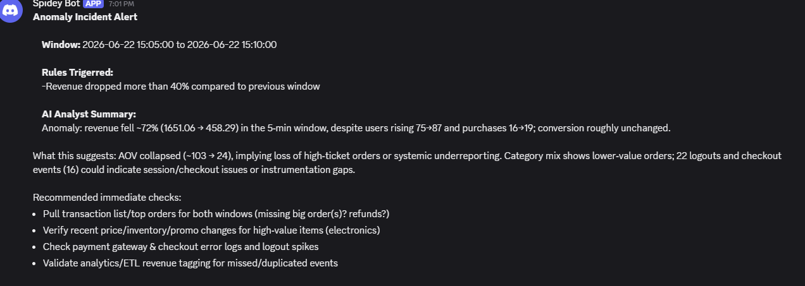

# Real-Time E-Commerce Events Anomaly Detection & AI Agent Alerting Platform

## Overview

This project demonstrates an end-to-end real-time data engineering and AI-powered monitoring platform built using both a local open-source stack and Databricks Lakehouse.

The platform simulates an e-commerce clickstream environment, processes events through a Medallion Architecture (Bronze → Silver → Gold), detects anomalies in near real time, and generates AI-powered incident summaries that are delivered automatically to a Discord channel.

The project was implemented in two environments:

1. **Local Streaming Platform**

   * Kafka
   * Spark Structured Streaming
   * Delta Lake
   * MinIO (S3-compatible storage)
   * Docker

2. **Databricks Lakehouse Platform**

   * Unity Catalog
   * Volumes
   * Delta Tables
   * Databricks Jobs
   * OpenAI Integration
   * Discord Notifications

---

## Business Problem

Modern digital platforms generate millions of events every day. Revenue-impacting issues such as checkout failures, payment gateway outages, tracking failures, or sudden traffic drops often remain unnoticed until significant business impact occurs.

This project aims to:

* Detect anomalies automatically
* Provide context-aware incident analysis
* Reduce time to detection
* Improve operational visibility
* Demonstrate modern Data Engineering + AI Agent patterns

---

# Architecture

## Local Streaming Architecture

```text
Event Generator
       │
       ▼
    Kafka
       │
       ▼
Bronze Layer
(Spark Streaming)
       │
       ▼
Silver Layer
(Data Quality + Cleansing)
       │
       ▼
Gold Layer
(KPI Aggregation)
       │
       ▼
Alerting Agent
(OpenAI)
       │
       ▼
Discord Notifications
```

### Technologies

* Python
* Kafka
* Spark Structured Streaming
* Delta Lake
* MinIO
* Docker
* OpenAI API
* Discord Webhooks

---

## Databricks Lakehouse Architecture

```text
JSON Event Generator
         │
         ▼
Databricks Volume
         │
         ▼
Bronze Delta Table
         │
         ▼
Silver Delta Table
         │
         ▼
Gold KPI Table
         │
         ▼
AI Alerting Agent
         │
         ▼
Discord Channel
```

### Technologies

* Databricks Free Edition
* Unity Catalog
* Delta Lake
* Databricks Jobs
* Structured Streaming
* OpenAI API
* Discord Webhooks

---

# Data Model

## Bronze Layer

Stores raw event data exactly as received.

### Example Schema

| Column          | Type      |
| --------------- | --------- |
| user_id         | string    |
| event_type      | string    |
| product_id      | string    |
| amount          | double    |
| page            | string    |
| event_timestamp | timestamp |

Purpose:

* Raw ingestion
* Replayability
* Auditability

---

## Silver Layer

Performs:

* Schema enforcement
* Data quality validation
* Deduplication
* Standardization

Additional Columns:

| Column            | Description          |
| ----------------- | -------------------- |
| processed_at      | Processing timestamp |
| validation_status | Valid / Invalid      |

---

## Gold Layer

Business KPI aggregation using 5-minute windows.

### Metrics

| Metric          | Description              |
| --------------- | ------------------------ |
| total_events    | Total events             |
| unique_users    | Approximate unique users |
| total_revenue   | Purchase revenue         |
| purchase_count  | Number of purchases      |
| conversion_rate | Purchases / Events       |
| avg_order_value | Revenue / Purchases      |

---

# Anomaly Detection Framework

Anomalies are detected using deterministic rules.

## Revenue Drop

Trigger:

```python
current_revenue < previous_revenue * 0.6
```

## Conversion Drop

Trigger:

```python
conversion_rate < 0.01
```

## Traffic Drop

Trigger:

```python
current_users < previous_users * 0.5
```

## No Purchases

Trigger:

```python
purchase_count == 0
```

---

# AI Alerting Agent

The Alerting Agent enriches KPI anomalies with supporting business context before generating an incident report.

## Inputs

### Gold Layer

* Revenue
* Conversion Rate
* Purchase Count
* Unique Users

### Silver Layer Context

#### Funnel Metrics

```text
page_view
product_view
add_to_cart
checkout
purchase
```

#### Category Metrics

```text
Electronics
Books
Clothing
```

#### Page Activity

```text
Home
Product
Cart
Checkout
```

---

## Agent Workflow

```text
Gold KPI Window
        │
        ▼
Anomaly Detection
        │
        ▼
Context Retrieval
        │
        ▼
OpenAI Analysis
        │
        ▼
Discord Notification
        │
        ▼
Alert History Table
```

---

# Discord Incident Notifications

Example Alert:

```

---

# Alert History

To prevent duplicate notifications, every alert is recorded.

### Schema

| Column          | Description       |
| --------------- | ----------------- |
| window_start    | Window start      |
| window_end      | Window end        |
| alert_sent_at   | Timestamp         |
| anomaly_reasons | Triggered rules   |
| alert_text      | Generated summary |

---

# Databricks Workflow

Workflow Tasks:

```text
Generate Events
        │
        ▼
Bronze Ingestion
        │
        ▼
Silver Transformation
        │
        ▼
Gold Aggregation
        │
        ▼
Alerting Agent
```

---

# Repository Structure

```text
real-time-anomaly-alerting-lakehouse/

├── README.md
│
├── local_docker_version/
│   ├── producer/
│   ├── spark_jobs/
│   ├── alerting/
│   └── docker-compose.yaml
│
├── databricks_version/
│   ├── notebooks/
│   ├── workflow/
│   └── sql/
│
├── screenshots/
│
├── architecture/
│
└── docs/
```

---

# Key Engineering Concepts Demonstrated

### Streaming Data Processing

* Spark Structured Streaming
* Event-time processing
* Watermarking
* Window aggregations

### Data Lakehouse

* Delta Lake
* Bronze/Silver/Gold architecture
* Incremental processing

### Data Quality

* Validation rules
* Deduplication
* Schema enforcement

### Observability

* KPI monitoring
* Alert history tracking
* Incident reporting

### AI Integration

* OpenAI-powered incident analysis
* Context-aware alert generation
* Automated operational notifications

---

# Future Enhancements

* Dynamic threshold detection
* Statistical anomaly detection
* ML-based forecasting
* Multi-channel notifications (Slack, Teams, PagerDuty)
* Agentic root-cause investigation
* Real-time dashboarding
* Historical anomaly trend analysis

---

# Skills Demonstrated

* Data Engineering
* Streaming Architectures
* Delta Lake
* Databricks
* PySpark
* Kafka
* Data Modeling
* Data Quality Engineering
* Workflow Orchestration
* AI Agents
* OpenAI Integration
* Production Monitoring
* Incident Management
* Cloud Data Platforms
